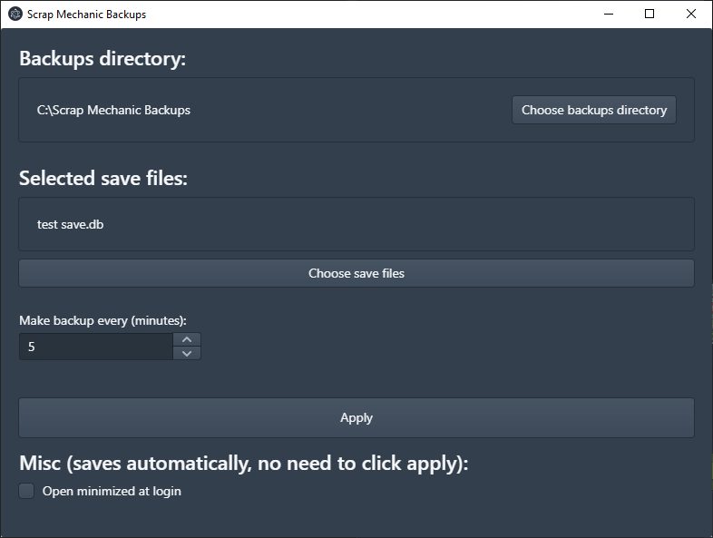

# Scrap Mechanic Backups

Simple tool allowing to backup [Scrap Mechanic](https://store.steampowered.com/app/387990/Scrap_Mechanic/) save files easily. 

Installer can be downloaded from [releases](https://github.com/groinder/scrap-mechanic-backups/releases) tab.

As we all know, Scrap Mechanic save files break sometimes. I've created this tool to not lose progress in survival when that happens.

## Features
- Choosing directory to store backups.
- Selecting multiple save files for backup (automatically opens survival save files directory).
- Setting custom backup interval.
- Stores last 12 backups (the oldest one is removed when 13th backup is created).
- Watches for file changes - only creates backup if one of selected save files have changed.
- Backups are created in form of `.zip` archives (you can restore them manually at your convinience).
- Closes to tray.
- Optional auto-starting at system login.

## Contributing

Pull Requests with changes are welcome. 

This project is bootstrapped using [Electron Forge](https://www.electronforge.io/). 

### Available scripts

- `yarn start` starts development version of the app, watches for file changes.
- `yarn package` packages the app to the executable and places it in `out/` directory.
- `yarn make` creates the executable and an installer, places it in `out/make/` directory.

## License

[MIT](./LICENSE)